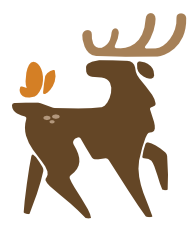

  

<h1 align="center">Twill</h1>

A Society of Fur toolkit for Wolvden

---

Twill reads the [Wolvden](https://www.wolvden.com/) page you already have open, lets you expand
on details you would otherwise need a separate document for, and gives you space to grow your
pack in a lore rich environment.

Hover a gene and get expanded details on where it comes from, how it might look bred with another
marking, and whether they can be a combo. Add detail to a wolf that you simply cannot see at a
glance without a separate lore document. Breeding challenges and planning your pack become easier.

**Twill will never play the game for you. We leave that to you.**

**[Read the full write up, with pictures &rarr;](https://trashgremlinx.github.io/Twill/)**

## Install

Two steps.

1. Install [Tampermonkey](https://www.tampermonkey.net/), a free browser extension. On Chrome and
   Edge, also open the extensions page, click **Details** on Tampermonkey and switch on **Allow
   User Scripts**. On older versions without that switch, turn on **Developer mode** instead.
2. Click **[twill.user.js](https://trashgremlinx.github.io/Twill/twill.user.js)** and press
   **Install** when Tampermonkey asks.

Then open Wolvden. The Twill mark sits in the corner of every page. Click it, or press `Alt+K`.

Updates happen by themselves after that. Nothing you have written or set is lost when it updates.
Don't want to wait? Click the Tampermonkey icon in your browser and choose **Check for userscript
updates**, or click the install link again. If Tampermonkey asks before installing the new version,
say yes.

## What is in it

14 tools, each of which can be switched off on its own.

| | |
|---|---|
| **Genetics** | Hover any gene for a card: what it is, where it comes from, what it pairs into, whether it is lethal. A wolf's personality gets a pill naming its disposition (Aggressive, Friendly, Romantic or Stoic) and a card of its own. Built from 251 bases, 194 eye colours, 2,370 markings, 28 mutations and 40 personalities |
| **Lore** | Your own fields on a wolf's page, in sections you name. Wolf-link fields cross reference both ways, so if one wolf is bonded to another, both pages say so |
| **Tray** | Pin two wolves, then pair them: what the pups could inherit slot by slot, what generation they will be, which personality groups they are likely to get, plus shared ancestors and the inbreeding figure for a pairing you have not made yet |
| **Pedigree** | Keeps the family trees the pairing check needs, for the wolves in your tray |
| **Collection** | A checklist of every base, eye colour and marking in the game. Tick what you have and Twill keeps count |
| **Den Manager** | A card above your caves: care, breeding, pups, roles, old age, trades. Every section folds on its own |
| **Wardrobe** | Custom decor as extra layers, plus looks you can save and try on again in the preview |
| **Item Lookup** | A magnifier on every item in your Hoard and on trades: 284 recipes, the catalogue, or the trading centre, already searched |
| **Shopping List** | Items you want tagged **buy**, items you would trade away tagged **in stock**, wherever they appear |
| **Store Front** | On Manage Your Trades: what to restock, and which trades have offers waiting |
| **Notepad** | A movable notepad on every page, `Alt+N`. Pictures by web address, and notes can be pinned to a wolf |
| **Explore bars** | Your Energy and HP drawn just above the explore box, so a phone never has to scroll down for them. On by default on phones, with a switch for computers |
| **Fishing colours** | An accessibility filter for red-blind and green-blind players. It does not point at the fish |
| **Hide users** | Collapses posts from players you would rather not read |

Plus **9 reference guides kept offline**: herbs, scouting, illnesses, prey, battle enemies,
befriending, roles, mutation pass rates and pair bonds. 28 herbs and 21 medicines, 18 illnesses,
61 prey, 146 enemies, every befriending move against every disposition, and what each role runs
on, joined up rather than sitting in separate tables.

And **eight themes** with a live editor, a post composer that catches those pesky HTML breaks,
and **Backup** so you can carry everything with you to another computer.

## What it will not do

- It **never loads a page for you**. No randomly opened tabs.
- It **never clicks, submits or fills a form for you**. No auto explore, no bump tools, no
  pre-chosen answers for battles or befriending.
- It **never refreshes** anything on a timer. You still bump your own trades, raffles and
  chatter posts.
- It **sends nothing anywhere**. No server, no account, no tracking, no analytics.
- It **does not gather up the site**. Nothing is kept from Wolvden beyond the wolves you pin
  to the tray, 8 at most, and they are forgotten when you take them out.

These are facts about the source rather than promises. There is no `fetch`, `XMLHttpRequest`,
`sendBeacon`, `WebSocket`, `setInterval`, `.submit()` or `location.href` anywhere in the file,
and the script runs with `@grant none`.

## Your data

Everything lives in your own browser's `localStorage`, under keys prefixed `denkit:`, and never
leaves your machine. Almost all of it is what you wrote yourself: notes, lore, goals, lists, your
Collection ticks and settings. The only thing taken from Wolvden's pages is the genes and family
tree of each wolf you pin to the tray, 8 at most, and those are deleted when the wolf leaves it.
Clearing site data removes all of it, so use **Backup** in the hub if you are moving computers.

The file is around 600KB because every fact it explains is bundled inside it: bases, eye colours,
markings, mutations, recipes, herbs, prey and battle enemies. That is what lets the guides work
without ever contacting anything.

## Thanks

**[The Grouse House Wiki](https://grousehouse.wiki/)** for the game facts, gathered by people who
did a great deal of careful work. Twill writes all of its content independently from facts
collected across the wiki, Wolvden and community discussion.

**Wolvden, by Lioden Ltd**, for the game, the art and the team behind it. This is an unofficial
fan tool and is not affiliated with or endorsed by them.

**The Society of Fur**, for thoughts, wishes and feedback throughout.

## Licence

Twill is free to use and free to pass on, and it asks to be passed on whole. Share the
link or the file as much as you like, keep the credit where it is, and do not sell it or
hand on a copy you have edited. An edited copy could break every promise above while
still wearing this name, which is the one thing that cannot be allowed to happen.

**[Read the licence](LICENCE.md)**

## Come say hello

- [Join us on Discord](https://discord.gg/ZQDz8ANTUR)
- [The guild on Wolvden](https://www.wolvden.com/g/society/991)

Bugs, ideas and requests are all welcome. By [Fallowe](https://www.wolvden.com/profile/145906).
